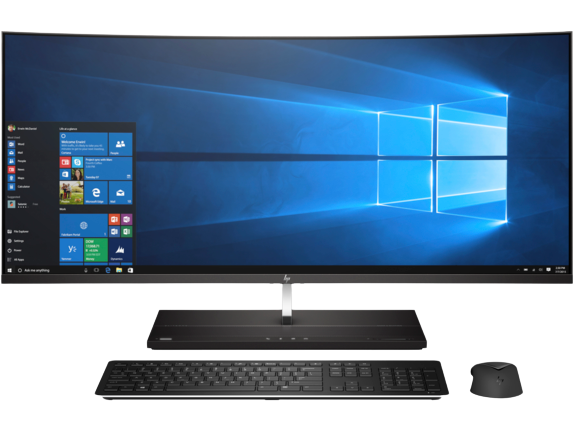

<html>
<head>
<title>
Computer Hardware
</title>
</head>
<body>

<h1>Computers</h1>

 

<h2>What are computers?</h2>
 

A computer is a digital electronic machine that can be programmed to carry out sequences of arithmetic or logical operations (computation) automatically. Modern computers can perform generic sets of operations known as programs. These programs enable computers to perform a wide range of tasks

 

 

<iframe width="560" height="315" src="https://www.youtube.com/embed/Cu3R5it4cQs" title="YouTube video player" frameborder="0" allow="accelerometer; autoplay; clipboard-write; encrypted-media; gyroscope; picture-in-picture" allowfullscreen></iframe>

<h2>How are computers useful to us?</h2>
 

Computer helps us to save our data, information, our files, photos, videos etc. Computers are today mainly used for storing information, Browsing, Internet activities, Creating presentations, Communication, Exploring world using internet and doing complex calculations

 

<b><h1>Parts of Computer</h1></b>
 

Click on a part of the computer to know more

 

 

<video controls width="500" height="250" loop><source src="parts.mp4" type="video/mp4"></video>

<map name="parts">
	<area shape="rect" coords="20,70,400,350" href="https://computerinfobits.com/what-is-a-monitor/" target="_blank">
	<area shape="rect" coords="410,30,600,360" href="https://www.techopedia.com/definition/2179/computer-cabinet" target="_blank">
	<area shape="rect" coords="40,400,420,450" href="https://en.wikipedia.org/wiki/Computer_keyboard" target="_blank">
	<area shape="circle" coords="490,400,570,450" href="https://en.wikipedia.org/wiki/Computer_mouse" target="blank">

<h1>Input and Output devices</h1>
 
<l><a href = "input.html" target="_blank">Input Devices</a></l> <l>......................</l> <l><a href = "output.html" target="_blank">Output Devices</a></l>
</img>

<video controls width="500" height="250" loop><source src="video.mp4" type="video/mp4"></video>

<video controls width="500" height="250" loop><source src="video2.mp4" type="video/mp4"></video>

</body>
</html>
